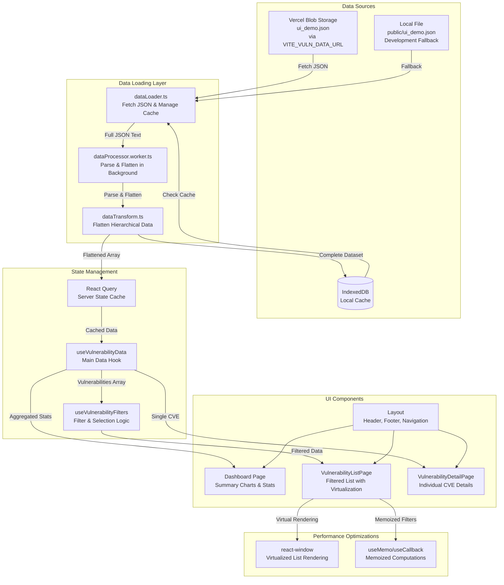

# Kai Cyber Dashboard

Interactive dashboard for exploring container image vulnerabilities with rich filtering, comparison tools, and data visualizations.

## Prerequisites
- Docker Desktop (includes the `docker compose` CLI)
- Node.js 20+ (only required for running locally without Docker)

## Quick Start (Docker Compose)
1. **Download sample data**
   - Fetch `ui_demo.json` from https://github.com/chanduusc/Ui-Demo-Data/blob/main/ui_demo.json
   - Save the file to `public/ui_demo.json`
2. **Start the dev stack**
   ```bash
   docker compose -f docker-compose.dev.yml up --build
   ```
3. **Open the app**
   - Visit http://localhost:5173
4. **Stop containers**
   ```bash
   docker compose -f docker-compose.dev.yml down
   ```

### Helpful Compose commands
```bash
# Run without rebuilding
docker compose -f docker-compose.dev.yml up

# Run in the background
docker compose -f docker-compose.dev.yml up -d

# Follow container logs
docker compose -f docker-compose.dev.yml logs -f
```

## Running Without Docker (optional)
```bash
npm install
npm run dev -- --host
```
The dev server listens on http://localhost:5173. Hot module reloading is enabled by Vite.

## Production Deployment (Vercel)

For production, the dashboard fetches data from **Vercel Blob Storage**:

1. **Upload JSON to Vercel Blob**
   - In Vercel Dashboard → Storage → Blob, upload `ui_demo.json`
   - Copy the public URL of the uploaded blob

2. **Set Environment Variable**
   - In Vercel Dashboard → Project Settings → Environment Variables
   - Add `VITE_VULN_DATA_URL` with the blob's public URL
   - Scope: Production (and Preview if desired)

3. **Deploy**
   - Push to your connected Git repository
   - Vercel will automatically build and deploy

The app will fetch data from the blob URL in production, while local development uses `public/ui_demo.json` as a fallback.

## Architecture Overview
- **Frontend framework**: React 18 with TypeScript, bundled by Vite
- **UI toolkit**: Chakra UI for theming, layout, and component primitives
- **Data fetching**: React Query (`@tanstack/react-query`) handles caching and async state
- **Routing**: React Router for page-level navigation (`Dashboard`, `Vulnerability List`, details views)
- **State & hooks**:
  - `useVulnerabilityData` loads and caches the flattened vulnerability dataset
  - `useVulnerabilityById` selects individual CVE records
- **Visualization**: Recharts for CVE trend and comparison charts
- **Lists & performance**: `react-window` is used for virtualized vulnerability lists to handle large datasets
- **Data layer**:
  - `services/dataLoader` fetches JSON file from Vercel Blob storage (or local fallback) and manages IndexedDB cache
  - `workers/dataProcessor.worker` offloads parsing to a Web Worker when available
  - `utils/dataTransform` flattens the hierarchical image → repo → group structure into list-friendly records
- **Layout**: `src/components/layout/Layout.tsx` provides a persistent header, footer, and preferences modal. During loading the footer stays pinned via flex layout.

### Architecture Diagram



**Data Flow:**
1. **Initial Load**: `dataLoader` checks IndexedDB cache first; if missing, fetches JSON from Vercel Blob (or local fallback)
2. **Background Parsing**: Full JSON is sent to Web Worker for parsing and flattening, preventing UI blocking
3. **Data Transformation**: Hierarchical structure (groups → repos → images → vulnerabilities) is flattened into a single array
4. **Caching**: Complete dataset is persisted to IndexedDB for instant subsequent loads
5. **UI Rendering**: React Query serves cached data to components, enabling fast filtering and search on subsequent visits

### Repository structure (key folders)
- `src/pages` – top-level pages rendered by the router
- `src/components` – reusable UI elements (vulnerability cards, comparison drawer, charts, settings modal, etc.)
- `src/hooks` – domain-specific hooks for data access
- `src/services` – data loading, caching, and background worker utilities
- `src/types` – TypeScript definitions for vulnerability metadata
- `public` – static assets, including the required `ui_demo.json`

## Development Notes
- Docker Compose mounts the project directory for instant hot reloads
- `public/ui_demo.json` is mounted read-only into the container; update the file locally to refresh data
- Vite dev server exposes the app on port 5173 (configured in `docker-compose.dev.yml`)
- Use `npm run build` to generate an optimized production build if needed
